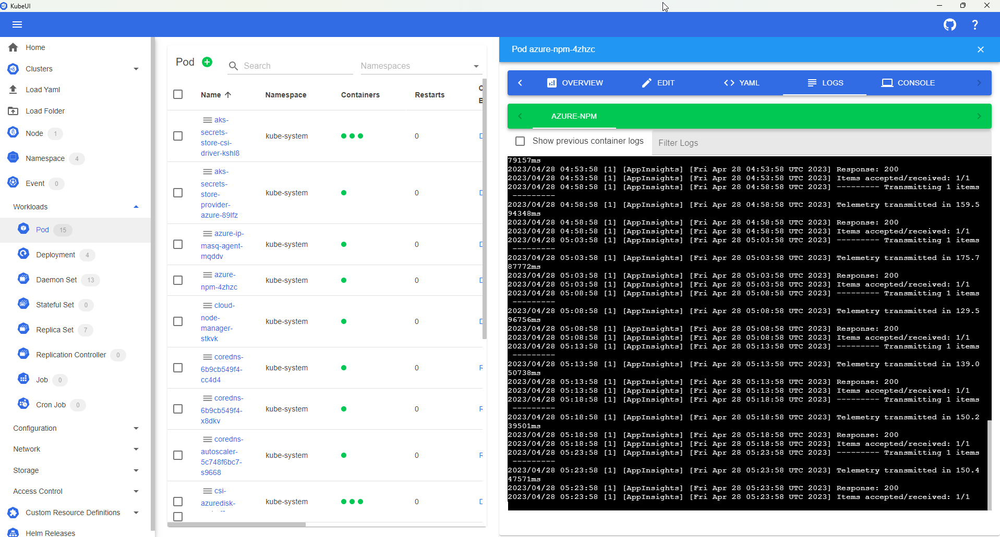

# [KubeUI.com](https://KubeUI.com)

## What is this?
KubeUI is a experimental user interface for Kubernetes.

## Example

## How to run?

Go to [Releases](https://github.com/IvanJosipovic/KubeUI/releases) and download the version for your OS.

Supported Platforms:

- Web
- Windows
- Future: Mac

## How to build?

1. [Download .Net Core SDK 7.0](https://dotnet.microsoft.com/download/dotnet-core/7.0)
2. [Download an IDE](https://dotnet.microsoft.com/platform/tools)
3. Build away!

## Stats

 
