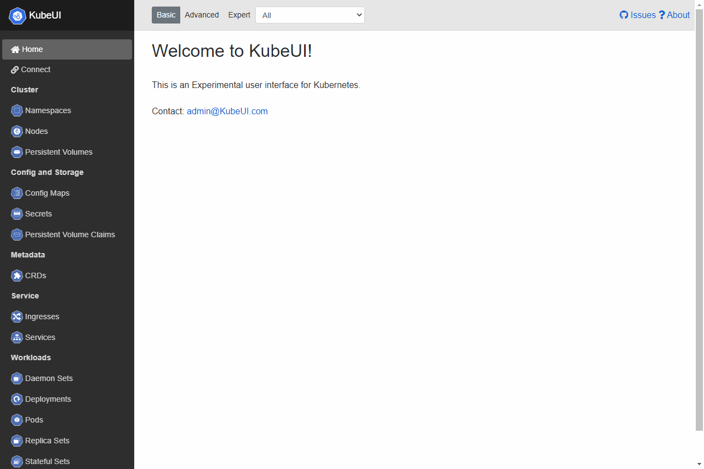

# [KubeUI.com](https://KubeUI.com)

## What is this?
KubeUI is a experimental user interface for Kubernetes. It's built using [Blazor](https://dotnet.microsoft.com/apps/aspnet/web-apps/blazor) and the [official C# Kubernetes Client](https://github.com/kubernetes-client/csharp).

## How to run?

### Web
**Please Note:** As this version of KubeUI operates in the browser, it's limited by [CORS](https://developer.mozilla.org/en-US/docs/Web/HTTP/CORS).

There are three options to get around CORS:
1. Download KubeUI Desktop

2. Kubectl Proxy + API Server change
    - Kubectl Proxy -p 8888
    - Add the following line to the [Kube API Server](https://kubernetes.io/docs/reference/command-line-tools-reference/kube-apiserver/) configuration:
      - --cors-allowed-origins=https://KubeUI.com

3. Kubectl Proxy + CORSProxy
   - Kubectl Proxy -p 8888
   - Run [CorsProxy](https://github.com/IvanJosipovic/CORSProxy)

### Desktop
**Please Note:** Windows users will need to install the new [Edge (Chromium)](https://www.microsoft.com/en-us/edge") or be on Windows 10 build 2004 or higher.

Download the correct version for your 

## How to build?

1. [Download .Net Core SDK 3.1.101](https://dotnet.microsoft.com/download/dotnet-core/3.1)
2. Download an IDE
     - [Visual Studio Community (Windows Only)](https://visualstudio.microsoft.com/downloads/)
     - [Visual Studio Code](https://code.visualstudio.com/?wt.mc_id=vscom_downloads)
     - [JetBrains Rider](https://www.jetbrains.com/rider/)
     - [MonoDevelop](https://www.monodevelop.com)
3. Build away!

### PRs are welcome!