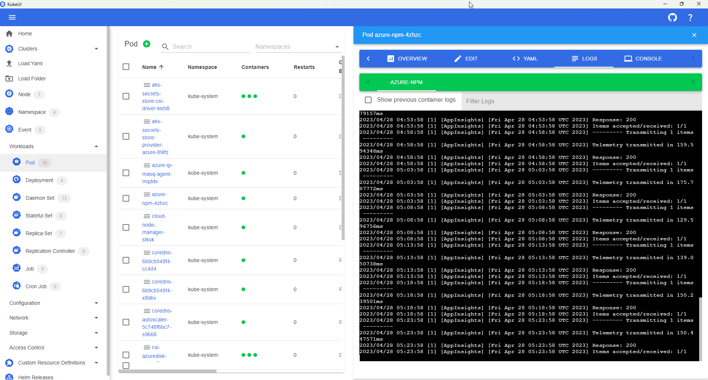

# KubeUI

KubeUI is a desktop Kubernetes client built for day to day cluster work. It combines resource browsing, YAML editing, operational actions, and cluster-aware tooling in a native cross-platform UI.

It is aimed at the common workflow of:

- connecting to one or more clusters
- browsing and filtering resources
- inspecting workload state
- editing manifests safely
- validating changes before applying them
- performing operational tasks without dropping to the terminal for every step

## What KubeUI Does

KubeUI provides a cluster workspace for exploring and operating Kubernetes resources with a strong focus on:

- fast resource discovery
- practical workload operations
- YAML-first editing with Kubernetes-aware assistance
- support for built-in resources and CRDs
- working correctly in environments with limited RBAC permissions

## Core Features

### Cluster and Workspace

- Connect to Kubernetes clusters from a desktop UI
- Multi-window and multi-monitor friendly workspace
- Dockable layout for working with multiple tools and views at once
- Automatic updates

### Resource Browsing

- Browse cluster resources in tabular views
- Filtering, sorting, and search across resource lists
- Namespace-aware navigation
- Support for Custom Resource Definitions (CRDs)
- Resource visualization features for understanding relationships between objects

### YAML Editor

- View and edit resources as YAML
- Kubernetes-aware completion for built-in resources and CRDs
- Field documentation inside completion tooltips
- YAML-specific editing behavior:
  - 2-space indentation
  - list continuation
  - smart list exit
  - block indent and unindent
- Validation while editing
- Inline validation feedback in the editor
- Server-side dry run from edit mode before saving

### Resource Operations

- Create, inspect, edit, and apply resources as YAML
- Dry run manifests against the API server
- Import YAML into the cluster

### Workload Tooling

- Pod logs
- Pod console / exec
- Pod port forwarding
- Service port forwarding
- Pod CPU and memory usage when metrics are available

### Resource-Specific Actions

- Node cordon
- Node uncordon
- Node drain
- Secret certificate inspection, including certificate detail views such as expiry

### Security and RBAC

- Works with limited permission sets
- Handles clusters where namespace list/watch access is restricted
- Supports namespace-scoped permissions and reduced-access workflows

## Supported Platforms

Releases are available for AMD64 and ARM64 on:

- Linux
- macOS
   - `brew install --cask IvanJosipovic/homebrew-repo/kubeui`
- Windows
  - `winget install KubeUI`
  - 

Download binaries from [Releases](https://github.com/IvanJosipovic/KubeUI/releases/latest).

## Build

Prerequisites:

- .NET SDK 10.0
- Docker

Build steps:

1. Install the .NET SDK from [dotnet.microsoft.com](https://dotnet.microsoft.com/en-us/download/dotnet/10.0)
2. Open the repository in your preferred .NET IDE or editor
3. Restore, build, and run the solution

## Project Structure

- `src/KubeUI.Kubernetes`
  Kubernetes runtime, cluster integration, serialization, and shared domain logic
- `src/KubeUI.Avalonia`
  Avalonia UI, view models, behaviors, and resource-specific features
- `src/KubeUI.Desktop`
  Desktop host and application startup

## License

## Stats

