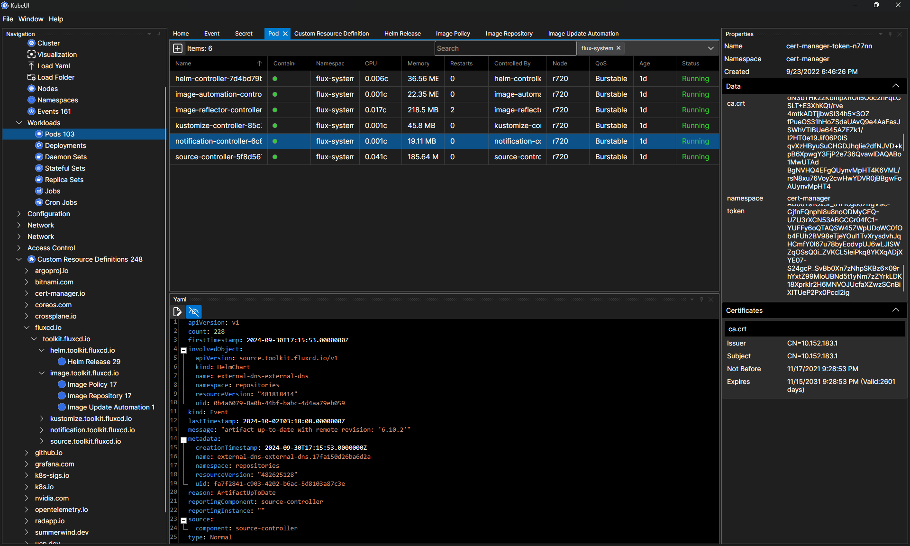

# KubeUI

## What is this?

KubeUI is a user interface for Kubernetes.

## Features

- Not Electron ;) Powered by [Avalonia](https://avaloniaui.net/)
- Create/View/Edit Resources as Yaml
- Connect to Cluster
- View Pod Logs
- View Pod Console
- Port Forwarding
- Custom Resource Definition support
- Automatic updates

## How to run?

Go to [Releases](https://github.com/IvanJosipovic/KubeUI/releases) and download the version for your OS.

Supported Platforms (AMD64 and ARM64):

- Linux
- Mac ([*Note Issue](https://github.com/IvanJosipovic/KubeUI/issues/688))
- Windows

## Example

## How to build?

1. [Download .Net SDK 8.0](https://dotnet.microsoft.com/en-us/download/dotnet/8.0)
2. [Download an IDE](https://dotnet.microsoft.com/platform/tools)
3. Build away!

## Stats

